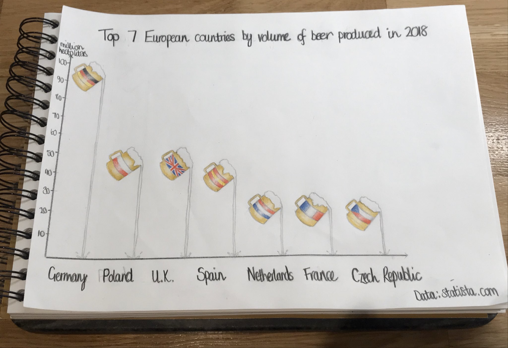

# Data visualisation 

Repo with different data visualisation projects (code, drawings, projects etc.). 

## Data Visualisation for Professionals project

Completed the [Data Visualisation for Professionals course](https://datavis-online.github.io/) in 2020 which covered how to visually explore data and design, implement and criticise data visualisations.

During the course we learnt about:

* human perception and data visualisation
- exploratory data analysis
- design & sketching
- the importance of interaction in exploration
- techniques for data visualisation (networks, temporal data, geographic data, multidimensional data etc.)
- storytelling and communication
- tools for data visualisation (d3, RAWgraphs, Sketch, Flourish, DataWrapper etc.)
- data physicalisation
- critical evaluation of visualisations

I have uploaded my final project which involved an end-to-end visualisation task from creating the brief and initial sketching through to implementation and user evaluation for which I received the highest possible grade, Merit. My final project used Scottish Government open data and looked at the percentage of population in Scotland who are in close proximity of green space and the change over time.

The final project was split into the following:  

* [1 page summary report](data_viz_professionals_project/project_summary_report.pdf)
* [Project journal (design thinking, sketches and tool testing)](data_viz_professionals_project/project_journal.pdf)
* [Data summary report](data_viz_professionals_project/data_summary.pdf)
* [Implementation report](data_viz_professionals_project/implementation_plan.pdf)
* [Evaluation plan](data_viz_professionals_project/evaluation_plan.pdf)

## Data drawings

Some drawings of data visualisations (mixture of pencil, pen and paint). 

